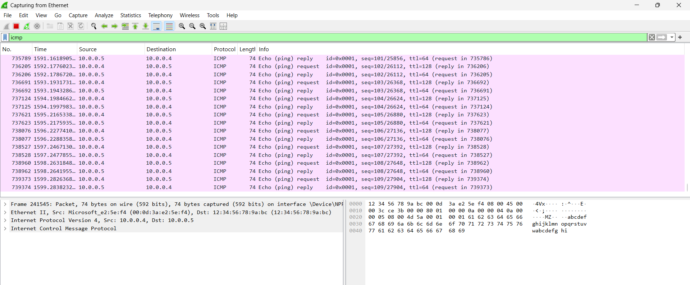
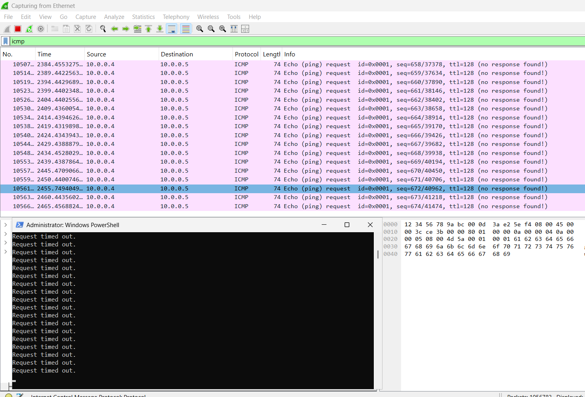
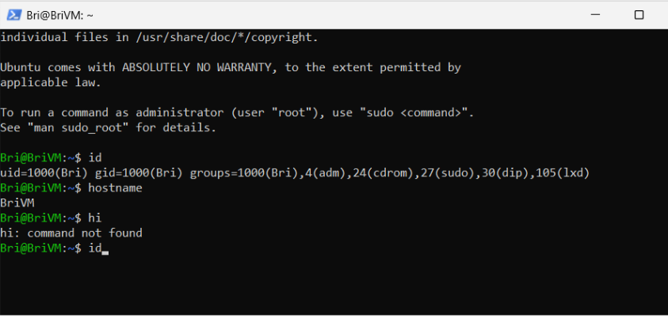
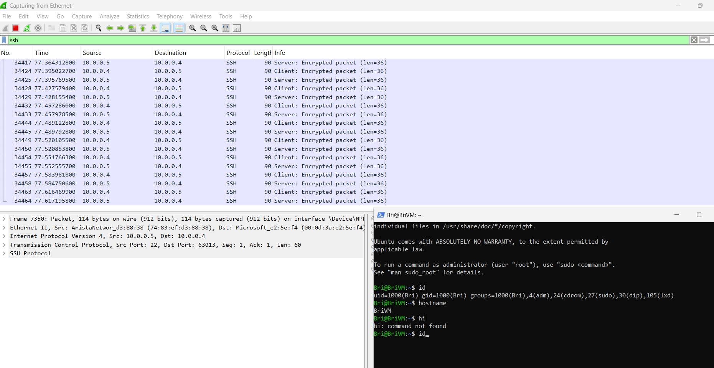

# Network-Traffic-Analysis
# Network Traffic Analysis Lab (Azure + Wireshark)

## Overview
This project demonstrates hands-on experience building and analyzing a cloud-based network environment using Microsoft Azure and Wireshark. I deployed and configured virtual machines, monitored real-time network traffic, and simulated security controls to understand how protocols behave under different conditions. 

## Tools & Technologies
- Microsoft Azure (Virtual Machines, Virtual Network, NSG)
- Windows 10 Virtual Machine
- Ubuntu Linux Virtual Machine
- Wireshark (Packet Analysis)
- PowerShell
- Remote Desktop (RDP)
- TCP/IP Networking (ICMP, SSH)

---

## Lab Steps

### 1. Cloud Infrastructure Setup
- Created a Resource Group in Microsoft Azure
- Deployed Windows 10 and Ubuntu Linux virtual machines
- Configured both systems within the same Virtual Network and Subnet to enable internal communication

---

### 2. Environment Access & Configuration
- Established remote access to the Windows VM using Remote Desktop
- Installed Wireshark to capture and analyze live network traffic

---

### 3. ICMP Traffic Analysis (Network Connectivity)
- Initiated packet capture in Wireshark and filtered for ICMP traffic
- Used PowerShell to ping the Ubuntu VM
- Observed successful echo requests and replies, confirming network connectivity

---

### 4. Network Security Simulation (Firewall Impact)
- Modified Network Security Group rules to block inbound ICMP traffic
- Continued ping requests from the Windows VM
- Observed request timeouts and absence of ICMP replies in Wireshark

---

### 5. Connectivity Restoration
- Re-enabled ICMP traffic in NSG
- Verified restored communication through successful ping responses and packet visibility

---

### 6. SSH Traffic Analysis (Secure Communication)
- Applied SSH filter in Wireshark
- Established SSH connection from Windows VM to Ubuntu VM via PowerShell
- Executed commands and analyzed encrypted SSH traffic in real time

---

## Key Skills Demonstrated
- Cloud infrastructure deployment and configuration using Microsoft Azure
- Network traffic analysis and packet inspection with Wireshark
- Troubleshooting connectivity issues using ICMP and PowerShell
- Understanding and configuring firewall rules using Network Security Groups
- Analyzing secure communication protocols such as SSH
- Supporting real-world IT operations through monitoring and diagnostics

---

## Conclusion
This lab strengthened my ability to analyze network behavior, troubleshoot connectivity issues, and understand how security controls impact communication in a cloud environment. It reflects my ability to combine IT support, networking fundamentals, and cloud technologies to solve real-world technical problems.

---
